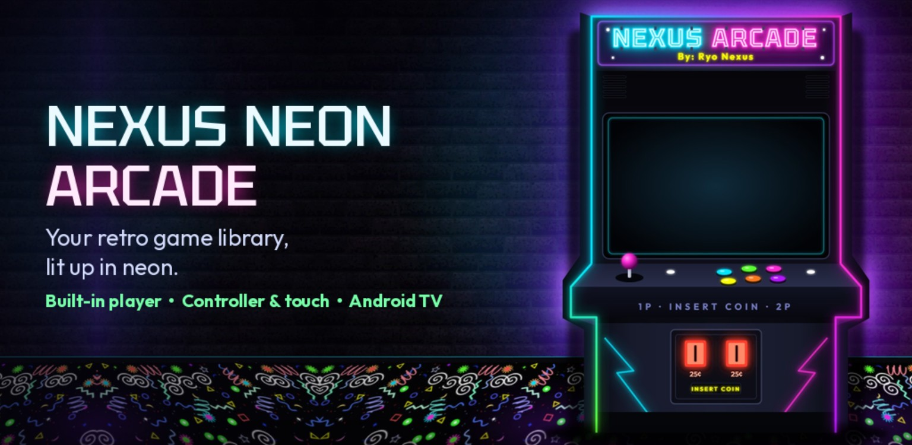
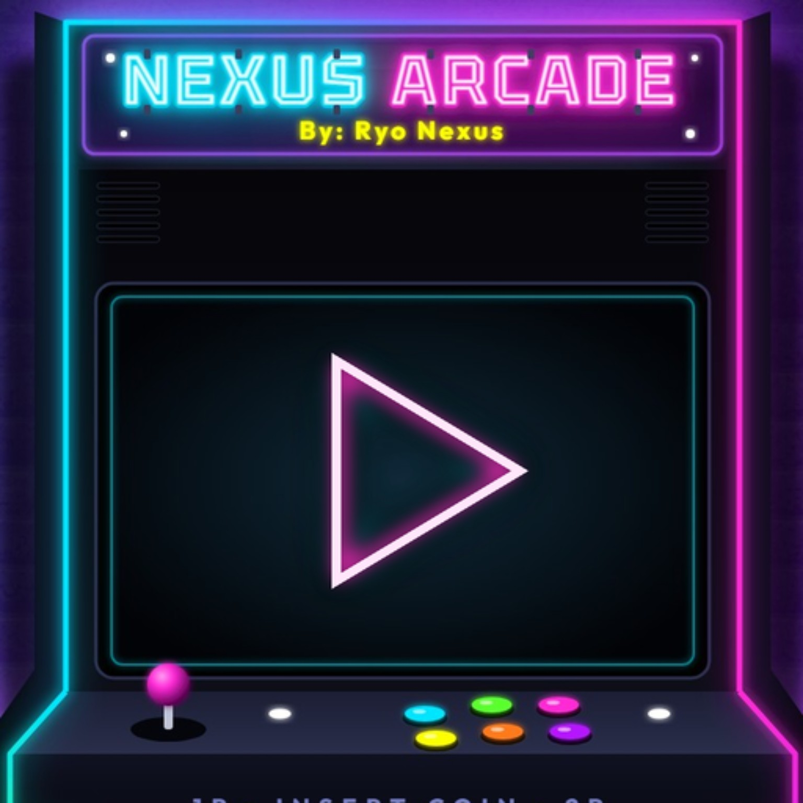
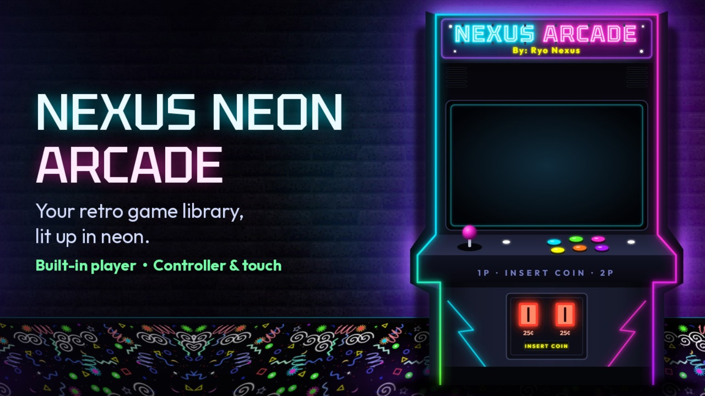

# Nexus Neon Arcade

**By Ryo Nexus — Your retro game library, lit up in neon.**

Nexus Neon Arcade brings your own games into a visual Android library with neon handheld and arcade cabinet themes. Browse by system, launch games with the built-in player or a compatible emulator app, and navigate with touch, a controller, a TV remote, or a keyboard.

**Current download: Android 3.3.4 test build.** This repository contains the APK, artwork, and this guide; a buildable source project is not included. Feature availability and game performance depend on the device, game, and emulator engine.

## Download and install

[Download the Android 3.3.4 test APK](NexusNeonArcade-Android-3_3_4-test-1.apk?raw=true)

1. Download the APK to your Android phone, tablet, or compatible Android TV device.
2. Open the downloaded file. If Android asks, allow that browser or file manager to install this app, then complete installation.
3. Open **Nexus Neon Arcade** and set up your game library using the steps below.

An APK installs on Android; it is not a Windows installer. This is a test build, so keep backups of your game saves before testing.

## What the app does

- **Organises your game library:** scan a ROM folder, browse games by system, switch between lists and cover-art grids, and access favourites and recently played games.
- **Plays supported games inside Nexus:** the built-in player uses emulator engines downloaded when needed, with on-screen controls, controller support, picture scaling, and engine settings. Some systems require BIOS files.
- **Launches external emulators:** detect installed emulator apps and RetroArch, choose an emulator or core per system, and configure custom installed apps as emulators. Compatibility varies; listing a system does not guarantee every game will run.
- **Includes Android apps and games:** automatically list detected Android games, add games manually, and add installed apps to the launcher.
- **Connects to Windows game launchers on Android:** add Windows game entries and open them through installed GameNative, GameHub, or Winlator. These launchers and their game setup are separate requirements.
- **Downloads artwork and media:** scrape a game, a selected system, or the whole library. Arcade Database supplies arcade artwork, details, and available gameplay videos; Libretro thumbnails supply other system artwork; Steam supplies Windows game artwork and optional trailers. These scraper sources require no account.
- **Uses existing ES-DE media:** choose your media folder to reuse compatible artwork and video files. Console preview videos can come from your own media collection.
- **Customises the presentation:** neon handheld or arcade cabinet themes, colour schemes and custom colours, backgrounds, cabinet concept art, glow and CRT effects, text size, UI scale, and game layouts.
- **Provides game tools:** favourites, game details, guides, cheats, and an in-game pause menu. Save/load state and other in-game actions depend on the selected engine or external emulator integration.

## Set up your library

1. Put your game files in subfolders named for their systems, for example **ROMs/snes**, **ROMs/ps2**, or **ROMs/arcade**.
2. Open the main menu using **Start** on a controller or the on-screen menu button.
3. Open **Game library**, grant **All files access** when required for scanning, and choose **Browse for ROM folder…**.
4. If you already have ES-DE artwork or videos, choose **Browse for media data folder…** as well.
5. Select **Save & rescan library**, return Home, choose a system, and select a game.

Supply your own game files and any required BIOS files. ROMs and BIOS files are not included in this repository.

## Choose how games play

**Built-in player:** open **Built-in player** in the main menu. Choose whether to use it for every supported system or only when an external emulator is missing. Download engines for your systems, add required BIOS files, and adjust on-screen controls, picture shape, and speed settings. Initial engine downloads need an internet connection.

**External emulator or RetroArch:** install and configure the emulator first. In **Emulator settings**, scan for installed emulator apps and RetroArch cores. Select a system on Home, press **Start**, and use that system's settings to choose its emulator or core. Install RetroArch cores inside RetroArch; scanning in Nexus does not install them.

**Android apps and games:** open **Android apps & games** to add installed apps, enable automatic game detection, or add a game that was not detected.

**Windows game entries:** open **Windows games**, select an installed launcher, and add a game's name. Configure and install the actual game inside that launcher. Adding an entry to Nexus does not install a Windows game.

## Controls

| Input | Action while browsing |
| --- | --- |
| Directional controls | Move between systems, games, and menu options |
| A | Select a system or launch a game |
| Hold A on a game | Scrape the game; enter a different search title when needed |
| B | Go back |
| Y on Home | Open favourites |
| Y on a game | Add or remove a favourite |
| Select on Home | Open recently played |
| Select on a game | Show details |
| X on a game | Open guides |
| Hold X on a game | Open cheats |
| Start / on-screen menu | Open settings |
| Touch | Tap to select; tap again to open |

Follow the on-screen control hints for the current page. In-game controls are handled by the player or emulator.

## Add artwork and videos

Open **Scraper** and choose missing artwork for all systems, the selected system only, or a complete re-scrape. Hold **A** on one game to scrape it individually and correct its search title.

Enable arcade gameplay videos or Windows game trailers in the scraper settings if desired. Downloads use internet data and storage. Existing console videos in compatible ES-DE media folders are used automatically; console videos are not supplied by the free scraper sources described above.

## Make it your own

Open **Theme & effects** to choose the handheld or arcade cabinet theme, colours, glow, CRT overlay, and Home background. Use **UI settings** for list/grid layouts, text size, spacing, and preview videos. Select a system and press **Start** to change its background, concept art, layout, or Home ordering.

For the optional in-game menu, open **In-game pause menu** and configure the controller combo. Android accessibility access is used for controller access while an external game is running; enable it only if you want that integration. RetroArch save/load integration may also require its network commands setting.

## Troubleshooting

- **No games appear:** check storage access, the ROM folder, system subfolder names, and hidden-system settings, then rescan.
- **A game will not launch:** check the selected emulator/core, installed engine, game format, and required BIOS. Try opening the game directly in the external emulator to verify its setup.
- **Artwork is missing or incorrect:** hold A on the game, correct the search title, and scrape again; check your media folder if using existing artwork.
- **Games run slowly:** try the built-in player's speed presets or the selected engine's settings. Performance is hardware- and game-dependent.
- **An APK update will not install:** Android may reject a different signing key or a lower version. Back up saves and settings before changing installations.

To report an issue, use this repository's **Issues** tab and include the app version, device, Android version, selected system/emulator, and steps to reproduce it.

## Android TV artwork

